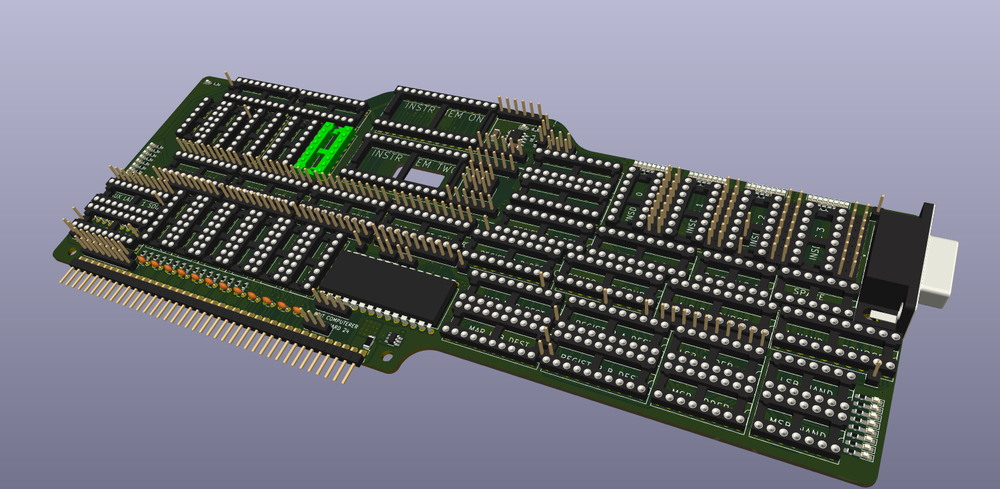

# Modular 8-bit Computer
This is the repository for an 8-bit computer system that is built using cards with a standardized interface. 


* [CPU card](processor_attempt_1)
* [Protoboard card](smaller_card_for_74_series)
  * This card contains an onboard clock generator, address and data registers/buffers, and a protoboard area for testing designs.
* [Bus interface modeling](digital)

Here's an example of a card:



## Current Bus Specification
```verilog
// The main bus wires (32+8=40 wires total)
// On the bus connector, all buses have LSBs closer to the power pins and MSBs farther away
wire VCC_5V;
wire GND;
wire clk;			      // generated by motherboard clock generator
wire rst_n;			    // probably a button on the motherboard
wire VCC_3V3;
wire we_n;			      // active LOW
wire oe_n;			      // active LOW
wire int_n;			    // pulled up by motherboard; driven down by any peripheral (could be used for interrupts)
wire [7:0] data;
wire [15:0] addr;	  // 64k address space is suppored by default. More address bits may be added later
wire [7:0] aux_bus;
```
